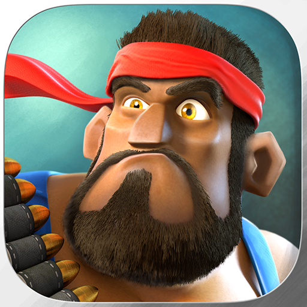

***

# Boom Beach

# By:

### Top

# `README.md`

***

# Index

[00.0 - Top](#Top)

[01.0 - Index](#Index)

[02.0 - Description](#SeansLifeArchive_Images_Boom-Beach)

[03.0 - About](#About)

[04.0 - Wiki](#Wiki)

[05.0 - Version history](#Version-history)

[06.0 - Contributers](#Contributers)

[07.0 - Issues](#Issues)

> [07.1 - Current issues](#Current-issues)

> [07.2 - Past issues](#Past-issues)

> [07.3 - Past pull requests](#Past-pull-requests)

> [07.4 - Active pull requests](#Active-pull-requests)

[08.0 - Resources](#Resources)

[09.0 - Contributing](#Contributing)

[10.0 - About README](#About-README)

[11.0 - README Version history](#README-version-history)

[12.0 - Footer](#You-have-reached-the-end-of-the-README-file)

***

# SeansLifeArchive_Images_Boom-Beach
The module for my life story project that contains my Boom Beach gameplay images.

***

## About

See above. This repository hosts all my weekly Boom Beach session pictures. I currently play the [Android version](https://play.google.com/store/apps/details?id=com.supercell.boombeach&hl=en)

These weekly pictures are to be used for progress monitoring, but can also be used as stock images.

I started playing Boom Beach all the way back in 2014. Even though it was before 2015, I didn't play play the [iOS version](https://apps.apple.com/us/app/boom-beach/id672150402).

I started playing the game again a few times, from 2014 to 2015, then from 2015 to 2018, then again in 2020.

***

## Wiki

[Click/tap here to view this projects Wiki](https://github.com/seanpm2001/SeansLifeArchive_Images_Boom-Beach/wiki)

***

## Version history

Unavailable

[More versions coming soon](https://www.example.com)

***

## Contributers

Currently, I am the only contributer. Contributing is not allowed, as this is a personal project.

> * 1. [seanpm2001](https://github.com/seanpm2001/) - 68 commits (As of Sunday, November 8th 2020 at 8:09 pm)

> * 2. No other contributers.

***

## Issues

### Current issues

None at the moment

### Past issues

None at the moment

### Past pull requests

None at the moment

### Active pull requests

None at the moment

***

## Resources

Here are some other resources for this project:

[Project language file](LANG.ss)

[Download an APK of Boom Beach using APKPure](https://apkpure.com/boom-beach/com.supercell.boombeach)

No other resources at the moment.

***

## Contributing

Contributing is not allowed for this project, as it is a personal project.

[Click/tap here to view the contributing rules for this project](https://github.com/seanpm2001/SeansLifeArchive_Images_Boom-Beach/blob/master/CONTRIBUTING.md)

***

## About README

File type: `Markdown (*.md)`

File version: `1 (Sunday, November 8th 2020 at 8:09 pm)`

Line count: `0,200`

***

## README version history

Version 1 (Sunday, November 8th 2020 at 8:09 pm)

> Changes:

> * Started the file

> * Added the title section

> * Added the index

> * Added the about section

> * Added the Wiki section

> * Added the version history section

> * Added the issues section.

> * Added the past issues section

> * Added the past pull requests section

> * Added the active pull requests section

> * Added the contributors section

> * Added the contributing section

> * Added the about README section

> * Added the resources section

> * Added the README version history section

> * No other changes in version 1

Version 2 (Coming soon)

> Changes:

> * Coming soon

> * No other changes in version 2

***

### You have reached the end of the README file

[Back to top](#Top) [Exit](https://github.com)

***
