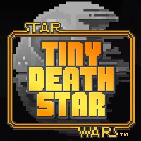

<!-- ALL-CONTRIBUTORS-BADGE:START - Do not remove or modify this section -->

<!-- ALL-CONTRIBUTORS-BADGE:END -->
***

# Tiny Death Star

# By:

# Licensed by:

### Top

# `README.md`

***

# Index

[00.0 - Top](#Top)

[01.0 - Index](#Index)

[02.0 - Description](#SeansLifeArchive_Images_TinyDeathStar)

[03.0 - About](#About)

[04.0 - Wiki](#Wiki)

[05.0 - Version history](#Version-history)

[06.0 - Contributers](#Contributers)

[07.0 - Issues](#Issues)

> [07.1 - Current issues](#Current-issues)

> [07.2 - Past issues](#Past-issues)

> [07.3 - Past pull requests](#Past-pull-requests)

> [07.4 - Active pull requests](#Active-pull-requests)

[08.0 - Resources](#Resources)

[09.0 - Contributing](#Contributing)

[10.0 - About README](#About-README)

[11.0 - README Version history](#README-version-history)

[12.0 - Footer](#You-have-reached-the-end-of-the-README-file)

***

# SeansLifeArchive_Images_TinyDeathStar
The module for my life story project that contains my NimbleBit × Disney: Tiny Death Star gameplay images. Unfortunately, this game randomly got pulled over half a decade ago, and can't be installed normally. Even then, it hasn't received updates in over 6 years, and all online functionality is gone. More information is available in this repositories README.md file.

***

## About

See above. This repository hosts all my daily Tiny Death Star session pictures. I currently play the [Android version](https://play.google.com/store) but when I originally played in 2013/2014, I also played the Android version. The game has been pulled from Android as of 2014, so how did I get it in 2020? I will explain in the next paragraph.

Recently on November 17th 2020, I was mass-downloading apps on my new Samsung Galaxy S20 FE (as of November 20th 2020, I am up to a total of 1091 apps) and I came across a nostalgic gold mine with my grandpas Google Play account, which spans back to 2008. I was able to re-download several games, including Tiny Death Star, as they had been downloaded in the past. I tested it on November 19th 2020, and the app still works. I am worrying that it may not work in Android 11. Of course, the app has no online functionality, but it is still completely playable. Apparently, you can still get the game without using this method, but you can't get it on Android or iOS, it is currently only officially supported on Amazon's FreeTime service.

These weekly pictures are to be used for progress monitoring, but can also be used as stock images. You can learn more about Tiny Tower Vegas by [clicking/tapping here](https://en.wikipedia.org/wiki/Star_Wars%3A_Tiny_Death_Star).

I played the game in the past on Android from 2013 to 2013 during a hotel stay. I played in the lobby. I made it to 7 floors, but didn't play any further.

I started playing again on November 19th 2020. I have been playing weekly ever since November 20th 2020.

***

## Wiki

[Click/tap here to view this projects Wiki](https://github.com/seanpm2001/SeansLifeArchive_Images_TinyDeathStar/wiki) <!-- Wiki is coming soon !-->

***

## Version history

1. None

2. [More versions coming soon](https://www.example.com)

***

## Contributers

Currently, I am the only contributer. Contributing is not allowed, as this is a personal project.

> * 1. [seanpm2001](https://github.com/seanpm2001/) - 28 commits (As of Friday, November 20th 2020 at 2:48 pm)

> * 2. No other contributers.

***

## Issues

### Current issues

No current issues

### Past issues

No past issues

### Past pull requests

No past pull requests

### Active pull requests

None at the moment

***

## Resources

Here are some other resources for this game:

<!--[Links.md - Links to various resources](LINKS.md)!-->

[PROJECT_LANG.e - The language file for this project](PROJECT_LANG.e)

[LICENSE.txt - The GPLV3 license used on this project](LICENSE.txt)

[Star Wars Wiki page on Tiny Death Star](https://starwars.fandom.com/wiki/Star_Wars:_Tiny_Death_Star)

[Star Wars Tiny Death Star Wikia fandom](https://tiny-death-star.fandom.com/wiki/Tiny_Death_Star_Wiki)

### Images

[Default Tiny Death Star logo](Tinydeathstar.png)

[NimbleBit logo](NimbleBit_Logo.png)

[Disney logo in 2013/2014](DisneyLogo2013.png)

No other resources at the moment

***

## Contributing

Contributing is not allowed for this project, as it is a personal project.

[Click/tap here to view the contributing rules for this project](CONTRIBUTING.md)

***

## About README

File type: `Markdown (*.md)`

File version: `1 (Friday, November 20th 2020 at 2:48 pm)`

Line count: `0,222`

***

## README version history

Version 1 (Friday, November 20th 2020 at 2:48 pm)

> Changes:

> * Started the file

> * Added the title section

> * Added the index

> * Added the about section

> * Added the Wiki section

> * Added the version history section

> * Added the issues section.

> * Added the past issues section

> * Added the past pull requests section

> * Added the active pull requests section

> * Added the contributors section

> * Added the contributing section

> * Added the about README section

> * Added the README version history section

> * Added the resources section

> * Added branding images to the top of the `README.md` file

> * No other changes in version 1

Version 2 (Coming soon)

> Changes:

> * Coming soon

> * No other changes in version 2

***

### You have reached the end of the README file

[Back to top](#Top) [Exit](https://github.com)

***

## Contributors ✨

Thanks goes to these wonderful people ([emoji key](https://allcontributors.org/docs/en/emoji-key)):

<!-- ALL-CONTRIBUTORS-LIST:START - Do not remove or modify this section -->
<!-- prettier-ignore-start -->
<!-- markdownlint-disable -->
<table>
  <tr>
    <td align="center"><a href="https://gist.github.com/seanpm2001/7e40a0e13c066a57577d8200b1afc6a3"> <b>Sean P. Myrick V19.1.7.2</b></a> <a href="https://github.com/seanpm2001/SeansLifeArchive_Images_TinyDeathStar/commits?author=seanpm2001" title="Code">💻</a> <a href="https://github.com/seanpm2001/SeansLifeArchive_Images_TinyDeathStar/commits?author=seanpm2001" title="Documentation">📖</a> <a href="#projectManagement-seanpm2001" title="Project Management">📆</a> <a href="#security-seanpm2001" title="Security">🛡️</a> <a href="#data-seanpm2001" title="Data">🔣</a> <a href="#content-seanpm2001" title="Content">🖋</a> <a href="#design-seanpm2001" title="Design">🎨</a> <a href="#maintenance-seanpm2001" title="Maintenance">🚧</a> <a href="#ideas-seanpm2001" title="Ideas, Planning, & Feedback">🤔</a></td>
  </tr>
</table>

<!-- markdownlint-restore -->
<!-- prettier-ignore-end -->

<!-- ALL-CONTRIBUTORS-LIST:END -->

This project follows the [all-contributors](https://github.com/all-contributors/all-contributors) specification. Contributions of any kind welcome!
