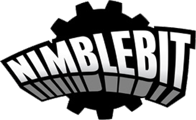

<!-- ALL-CONTRIBUTORS-BADGE:START - Do not remove or modify this section -->

<!-- ALL-CONTRIBUTORS-BADGE:END -->
***

# Lego Tower

# By:

### Top

# `README.md`

***

# Index

[00.0 - Top](#Top)

[01.0 - Index](#Index)

[02.0 - Description](#SeansLifeArchive_Images_LegoTower)

[03.0 - About](#About)

[04.0 - Wiki](#Wiki)

[05.0 - Version history](#Version-history)

[06.0 - Contributers](#Contributers)

[07.0 - Contributing](#Contributing)

[08.0 - Issues](#Issues)

> [08.1 - Current issues](#Current-issues)

> [08.2 - Past issues](#Past-issues)

> [08.3 - Past pull requests](#Past-pull-requests)

> [08.4 - Active pull requests](#Active-pull-requests)

[09.0 - Resources](#Resources)

[10.0 - About README](#About-README)

[11.0 - README Version history](#README-version-history)

[12.0 - Footer](#You-have-reached-the-end-of-the-README-file)

***

# SeansLifeArchive_Images_LegoTower
The module for my life story project that contains my Lego Tower gameplay images.

***

## About

See above
See above. This repository hosts all weekly Lego Tower session pictures. I currently play the [Android version](https://play.google.com/store/apps/details?id=com.nimblebit.legotower&hl=en_US&gl=US) there is a version available for iOS. It is listed below

These weekly pictures are to be used for progress monitoring, but can also be used as stock images.

I started playing Lego Tower during my 2020 NimbleBit fan phase. It is a decent game.

***

## Wiki

[Click/tap here to view this projects Wiki](https://github.com/seanpm2001/SeansLifeArchive_Images_LegoTower/wiki)

***

## Version history

Unavailable

[More versions coming soon](https://www.example.com)

***

## Contributers

Currently, I am the only contributer. Contributing is not allowed, as this is a personal project.

> * 1. [seanpm2001](https://github.com/seanpm2001/) - 94 commits (As of Thursday, November 12th 2020 at 11:56 am)

> * 2. No other contributers.

***

## Contributing

Contributing is not allowed for this project, as it is a personal project.

[Click/tap here to view the contributing rules for this project](CONTRIBUTING.md)

***

## Issues

### Current issues

None at the moment

### Past issues

None at the moment

### Past pull requests

None at the moment

### Active pull requests

None at the moment

***

## Resources

Here are some other resources for this project:

[Project language file](LANG.boo)

[Lego Tower on the Apple App store)](https://apps.apple.com/us/app/lego-tower/id1433811063)

[Download an APK of Lego Tower using APKPure](https://apkpure.com/lego%C2%AE-tower/com.nimblebit.legotower)

[Wikipedia article on Lego Tower (doesn't exist)](https://en.wikipedia.org)

[Lego Tower wiki (WARNING: NO HTTPS CONNECTION)](http://lego.towerwiki.com/wiki/Main_Page)

[NimbleBit website](http://nimblebit.com/)

### Images

[Lego TOwer app icon (jpeg)](LegoTower_Logo.jpeg)

[NimbleBit Logo (png)](NimbleBit_Logo.png)

No other resources at the moment.

***

## About README

File type: `Markdown (*.md)`

File version: `2 (Thursday, November 12th 2020 at 11:56 pm)`

Line count: `0,232`

***

## README version history

Version 1 (Wednesday, September 23rd 2020 at 4:30 pm)

> Changes:

> * Started the file

> * Added the title section

> * Added the index

> * Added the about section

> * Added the Wiki section

> * Added the version history section

> * Added the contributors section

> * Added the contributing section

> * Added the about README section

> * Added the README version history section

> * No other changes in version 1

Version 2 (Thursday, November 12th 2020 at 11:56 am)

> Changes:

> * Updated the about section

> * Added the resources section

> * Added release notes for v2

> * Added template entries for v3 and v4

> * Updated the file info section

> * Updated the index

> * Updated the contributers section

> * No other changes in version 2

Version 3 (coming soon)

> Changes:

> * Coming soon

> * No other changes in version 3

Version 4 (coming soon)

> Changes:

> * Coming soon

> * No other changes in version 4

***

### You have reached the end of the README file

[Back to top](#Top) [Exit](https://github.com)

***

## Contributors ✨

Thanks goes to these wonderful people ([emoji key](https://allcontributors.org/docs/en/emoji-key)):

<!-- ALL-CONTRIBUTORS-LIST:START - Do not remove or modify this section -->
<!-- prettier-ignore-start -->
<!-- markdownlint-disable -->
<table>
  <tr>
    <td align="center"><a href="https://gist.github.com/seanpm2001/7e40a0e13c066a57577d8200b1afc6a3"> <b>Sean P. Myrick V19.1.7.2</b></a> <a href="https://github.com/seanpm2001/SeansLifeArchive_Images_LegoTower/commits?author=seanpm2001" title="Code">💻</a> <a href="https://github.com/seanpm2001/SeansLifeArchive_Images_LegoTower/commits?author=seanpm2001" title="Documentation">📖</a> <a href="#projectManagement-seanpm2001" title="Project Management">📆</a> <a href="#security-seanpm2001" title="Security">🛡️</a> <a href="#data-seanpm2001" title="Data">🔣</a> <a href="#content-seanpm2001" title="Content">🖋</a> <a href="#design-seanpm2001" title="Design">🎨</a> <a href="#maintenance-seanpm2001" title="Maintenance">🚧</a> <a href="#ideas-seanpm2001" title="Ideas, Planning, & Feedback">🤔</a></td>
  </tr>
</table>

<!-- markdownlint-restore -->
<!-- prettier-ignore-end -->

<!-- ALL-CONTRIBUTORS-LIST:END -->

This project follows the [all-contributors](https://github.com/all-contributors/all-contributors) specification. Contributions of any kind welcome!
